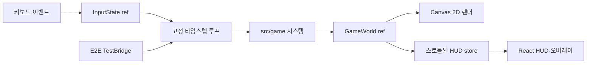

# 시스템 아키텍처

## 개요

Trickal Shooting은 브라우저 한 탭에서 완결되는 클라이언트 게임이다. 게임 로직과 Canvas backing store는 800×600 논리 해상도를 유지하고, 화면에는 뷰포트 안의 최대 4:3 크기로 반응형 표시한다. React는 화면 조합과 HUD만 담당하고, 매 프레임 실행되는 게임 상태는 React state가 아닌 `GameWorld` ref에 보관한다. 이 분리는 렌더 횟수를 통제하면서 게임 규칙을 DOM 없이 테스트할 수 있게 한다.

## 실제 기술 스택

아래 버전은 2026-08-14에 `npm ls --depth=0`으로 확인한 설치본이다.

| 영역                 | 기술                             | 설치 버전               |
| -------------------- | -------------------------------- | ----------------------- |
| 런타임 UI            | React / React DOM                | 19.2.8                  |
| 언어                 | TypeScript strict                | 5.9.3                   |
| 개발·빌드            | Vite                             | 7.3.6                   |
| 단위·컴포넌트 테스트 | Vitest / Testing Library / jsdom | 3.2.7 / 16.3.2 / 25.0.1 |
| 브라우저 테스트      | Playwright                       | 1.62.1                  |
| 정적 분석            | ESLint / typescript-eslint       | 9.39.5 / 8.67.0         |
| 포맷                 | Prettier                         | 3.9.6                   |

검증 환경은 Node.js 24.16.0과 npm 11.13.0이다. Vite 7의 최소 Node.js 요구사항을 충족하는 환경을 사용해야 한다.

## 계층과 책임

| 계층       | 경로                | 책임                                                 | 외부 상태 접근           |
| ---------- | ------------------- | ---------------------------------------------------- | ------------------------ |
| 계약       | `src/contracts/**`  | 엔티티, 월드, 시스템 함수, UI, 밸런스 타입의 SSOT    | 없음, 런타임 값 없음     |
| 시뮬레이션 | `src/game/**`       | 이동, 발사, 스폰, 충돌, 전투, 진행, 월드 생성        | DOM 금지, 시간·난수 주입 |
| 접착       | `src/hooks/**`      | 키 입력 변환, rAF 수명주기, 고정 스텝 누산, HUD 발행 | DOM, rAF                 |
| 렌더       | `src/render/**`     | 월드를 읽어 Canvas 2D에 도형으로 표현                | Canvas context만 변경    |
| UI         | `src/ui/**`         | 캔버스·HUD·게임오버 오버레이 조합                    | React DOM                |
| 관측       | `src/testBridge.ts` | E2E 전용 결정적 시드·틱 진행·HUD 조회                | `?e2e=1`에서만 설치      |

## 틱 실행 순서

`stepWorld`는 `playing` 상태에서만 다음 순서를 한 번 실행한다.

1. 무기 쿨다운 감소와 발사
2. 플레이어·적·투사체 이동 및 화면 이탈 처리
3. 적 스폰 타이머 처리
4. 부수효과 없는 AABB 충돌 탐지
5. 투사체 피해와 플레이어 접촉 피해 적용
6. MANA, SCORE 임계 레벨, 게임오버 진행 처리
7. `alive === false` 엔티티 일괄 제거

루프는 60Hz 고정 스텝을 누산한다. 긴 프레임은 250ms로 제한하고 한 화면 프레임에서 최대 5개 서브스텝만 처리한다. 탭이 숨겨지면 rAF를 취소하고 복귀 시 누산 시간을 버려 순간적인 대량 시뮬레이션을 방지한다.

## 주요 아키텍처 결정

### TypeScript 계약을 실행 코드와 분리

`src/contracts/**`에는 타입과 인터페이스만 존재한다. 구현 함수는 `StepWorld`, `ApplyMovement` 같은 명명된 함수 타입에 직접 결박된다. 계약 이탈은 문서 리뷰가 아니라 타입 검사 실패로 드러난다.

순수 JavaScript와 JSDoc 조합은 판별 유니온의 완전성, 계약 강제력과 리팩터링 안전성이 낮아 채택하지 않았다.

### React state 밖에 게임 월드 보관

60Hz 월드를 React state로 갱신하면 불필요한 reconciliation과 stale closure 위험이 커진다. 월드는 `useRef`에서 직접 갱신하고 HUD만 `useSyncExternalStore`를 통해 최대 10Hz로 발행한다. 게임 상태 전환은 스로틀을 무시하고 즉시 발행한다.

Redux, Zustand 같은 외부 상태 라이브러리는 이 규모의 프레임 루프에 불필요해 도입하지 않았다.

### 결정적 고정 타임스텝

시뮬레이션은 실제 프레임 델타 대신 고정 `dt`를 받고, 난수가 필요한 시스템은 시드 기반 `Rng`를 인자로 받는다. 같은 초기 월드, 입력, 시드, 틱 수는 같은 결과를 만든다. 이 구조 덕분에 단위 테스트와 E2E가 실시간 대기 없이 게임 규칙을 재현한다.

### Canvas 렌더와 게임 규칙 분리

게임 시스템은 좌표와 엔티티만 다루고 Canvas API를 참조하지 않는다. 엔티티 시각 표현은 `src/render/drawEntity.ts` 한 곳에 집중되어 향후 스프라이트로 교체해도 게임 규칙과 React UI를 수정하지 않도록 했다.

Phaser, PixiJS 같은 엔진은 자체 루프 구조를 검증한다는 그레이박스 목적과 맞지 않아 도입하지 않았다.

### 논리 해상도와 반응형 표시 분리

게임 시스템과 렌더 함수는 항상 800×600 논리 좌표만 사용한다. `GameCanvas`는 DPR에 맞는 backing store만 설정하며 CSS 픽셀 크기를 인라인으로 고정하지 않는다. `.game-board`가 `vw`와 `dvh`를 이용해 뷰포트 안에 완전히 들어오는 최대 4:3 크기를 계산하고, 캔버스·HUD·게임오버 오버레이는 이 보드 좌표계를 공유한다.

와이드 화면의 남는 영역은 레터박스로 유지해 게임 화면을 늘이거나 자르지 않는다. 모바일은 가로 표시 레이아웃까지 지원하며 터치 입력은 별도 범위다. Playwright는 데스크톱 1440×900, 태블릿 1024×768, 모바일 가로 844×390에서 비율·중앙 정렬·HUD 가시성·문서 무스크롤을 검증한다.

### 제한된 E2E 브릿지

Canvas 내부 상태는 DOM 선택자로 직접 관측할 수 없다. `?e2e=1`일 때만 별도 청크를 불러 `getSnapshot`, `stepFrames`, `seed` 세 메서드를 노출한다. 점수나 HP를 직접 바꾸는 치트 API는 제공하지 않는다. 일반 경로에서는 브릿지가 설치되지 않고 컴포넌트 해제 시 전역 참조도 제거된다.

## 품질·안전 경계

- 적은 최대 40개, 투사체는 최대 60개로 제한한다.
- AABB 경계가 닿기만 한 경우는 충돌이 아니다.
- React 렌더 오류는 Error Boundary가, 루프 오류는 루프 내부 예외 경계가 격리한다.
- `innerHTML`, `eval`, 외부 네트워크 요청과 영속 저장을 사용하지 않는다.
- Canvas에는 접근 가능한 이름이 있고 HUD 정보는 실제 DOM 텍스트로 제공된다.

## 범위 밖

백엔드, 인증, 데이터베이스, 멀티플레이, 랭킹, 로컬 영속화, CI/CD, 배포 설정, 실제 이미지·사운드 에셋, 모바일 터치 조작과 MANA 스킬 발동은 현재 그레이박스 범위가 아니다.
