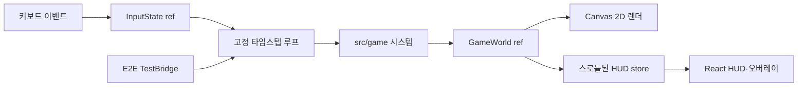

# 시스템 아키텍처

## 개요

Trickal Shooting은 브라우저 한 탭에서 완결되는 클라이언트 게임이다. 게임 로직과 Canvas backing store는 800×600 논리 해상도를 유지하고, 화면에는 뷰포트 안의 최대 4:3 크기로 반응형 표시한다. React는 화면 조합과 HUD만 담당하고, 매 프레임 실행되는 게임 상태는 React state가 아닌 `GameWorld` ref에 보관한다. 이 분리는 렌더 횟수를 통제하면서 게임 규칙을 DOM 없이 테스트할 수 있게 한다.



## 실제 기술 스택

아래 버전은 2026-08-14에 `npm ls --depth=0`으로 확인한 설치본이다.

| 영역                 | 기술                             | 설치 버전               |
| -------------------- | -------------------------------- | ----------------------- |
| 런타임 UI            | React / React DOM                | 19.2.8                  |
| 언어                 | TypeScript strict                | 5.9.3                   |
| 개발·빌드            | Vite                             | 7.3.6                   |
| 단위·컴포넌트 테스트 | Vitest / Testing Library / jsdom | 3.2.7 / 16.3.2 / 25.0.1 |
| 브라우저 테스트      | Playwright                       | 1.62.1                  |
| 정적 분석            | ESLint / typescript-eslint       | 9.39.5 / 8.67.0         |
| 포맷                 | Prettier                         | 3.9.6                   |

검증 환경은 Node.js 24.16.0과 npm 11.13.0이다. Vite 7의 최소 Node.js 요구사항을 충족하는 환경을 사용해야 한다.

## 계층과 책임

| 계층       | 경로                | 책임                                                 | 외부 상태 접근           |
| ---------- | ------------------- | ---------------------------------------------------- | ------------------------ |
| 계약       | `src/contracts/**`  | 엔티티, 월드, 시스템 함수, UI, 밸런스 타입의 SSOT    | 없음, 런타임 값 없음     |
| 시뮬레이션 | `src/game/**`       | 이동, 발사, 스폰, 충돌, 전투, 진행, 월드 생성        | DOM 금지, 시간·난수 주입 |
| 접착       | `src/hooks/**`      | 키 입력 변환, rAF 수명주기, 고정 스텝 누산, HUD 발행 | DOM, rAF                 |
| 렌더       | `src/render/**`     | 월드를 읽어 Canvas 2D에 도형으로 표현                | Canvas context만 변경    |
| UI         | `src/ui/**`         | 캔버스·HUD·게임오버 오버레이 조합                    | React DOM                |
| 관측       | `src/testBridge.ts` | E2E 전용 결정적 시드·틱 진행·HUD 조회                | `?e2e=1`에서만 설치      |

## 틱 실행 순서

`stepWorld`는 `playing` 상태에서만 다음 순서를 한 번 실행한다.

1. 일반탄·스킬탄 쿨다운 감소, Space/MANA 모드 전이와 상호 배제 발사(실제 스킬탄 생성 시 RNG 1회 소비)
2. 플레이어·적·일반탄 이동과 스킬탄 락온·근접 부스트 관성 조향 및 화면 이탈 처리
3. 적 스폰 타이머 처리
4. 부수효과 없는 AABB 충돌 탐지
5. 일반탄·스킬탄 피해·보상을 분리 적용하고 플레이어 접촉 피해 처리
6. MANA 포화, SCORE 임계 레벨, 게임오버 진행 처리
7. `alive === false` 엔티티 일괄 제거

루프는 60Hz 고정 스텝을 누산한다. 긴 프레임은 250ms로 제한하고 한 화면 프레임에서 최대 5개 서브스텝만 처리한다. 탭이 숨겨지면 rAF를 취소하고 복귀 시 누산 시간을 버려 순간적인 대량 시뮬레이션을 방지한다.

## 적 투사체 발사 시스템 (issue #17 — 8방향 일제 사격)

`GameWorld`는 플레이어·일반탄·스킬탄에 더하여 `enemyProjectiles` 배열을 보관한다. 적이 일정 주기마다 화면 모든 방향으로 직진 투사체를 발사하는 시스템이다.

**속도와 주기의 서로 다른 규칙 — 핵심 설계 포인트**

- **투사체 속도(`projSpeed`)는 스폰 시점에 현재 레벨을 기준으로 계산하고 이후 불변이다.** 같은 Enemy가 레벨업 후에도 처음 계산된 속도로 투사체를 발사한다. 새로 스폰되는 Enemy는 그 시점의 최신 레벨로 다시 계산된 속도를 갖는다.
  ```
  projSpeed = clamp(
    speedBase + speedPerLevel * (spawnLevel - 1),
    speedBase,
    speedMax
  )
  ```
- **발사 주기는 스냅샷이 아니라 매 리셋마다 현재 레벨을 기준으로 재계산한다.** 스폰 직후와 이전 발사 쿨다운 만료 시마다 그 순간의 최신 레벨로 다음 발사 간격을 정한다. 같은 Enemy도 레벨업 후 다음 발사부터 더 짧은 간격으로 쏠 수 있다.
  ```
  fireIntervalSec = max(
    fireIntervalBase - fireIntervalDecayPerLevel * (level - 1),
    fireIntervalMinSec
  )
  ```

**방향 선택과 이탈 판정**

- 한 번의 발사에서 `0~7` 중 하나를 선택해 8방향(0°/45°/90°/135°/180°/225°/270°/315°) 중 무작위 방향으로 투사체를 발사한다. 방향 선택은 주입된 RNG로 결정적이다.
- `EnemyProjectile`은 생성 후 속도가 절대 바뀌지 않으며(기존 스킬탄과 대비, 스킬탄은 매 틱 재조향), 플레이어 투사체와 달리 **화면의 상·하·좌·우 네 변 중 어느 방향으로든 완전히 벗어나면 소멸한다.** 일반탄은 우측 이탈만 검사하므로 이것이 중요한 차이다.
  ```
  offscreen =
       projectile.x + width  < 0                     // 좌측
    || projectile.x          > world.bounds.width   // 우측
    || projectile.y + height < 0                     // 상단
    || projectile.y          > world.bounds.height  // 하단
  ```

**충돌과 무적 공유**

플레이어와 접촉한 일반탄/스킬탄·적과의 직접 접촉이 모두 `invulnRemainSec` 무적 타이머를 공유하듯, `EnemyProjectile` 피격도 **동일한 무적 시간을 공유**한다. 무적 중에는 피해가 추가로 발생하지 않지만, 투사체 자체는 즉시 소멸한다.

## 주요 아키텍처 결정

### TypeScript 계약을 실행 코드와 분리

`src/contracts/**`에는 타입과 인터페이스만 존재한다. 구현 함수는 `StepWorld`, `ApplyMovement` 같은 명명된 함수 타입에 직접 결박된다. 계약 이탈은 문서 리뷰가 아니라 타입 검사 실패로 드러난다.

순수 JavaScript와 JSDoc 조합은 판별 유니온의 완전성, 계약 강제력과 리팩터링 안전성이 낮아 채택하지 않았다.

### React state 밖에 게임 월드 보관

60Hz 월드를 React state로 갱신하면 불필요한 reconciliation과 stale closure 위험이 커진다. 월드는 `useRef`에서 직접 갱신하고 HUD만 `useSyncExternalStore`를 통해 최대 10Hz로 발행한다. 게임 상태 전환은 스로틀을 무시하고 즉시 발행한다.

Redux, Zustand 같은 외부 상태 라이브러리는 이 규모의 프레임 루프에 불필요해 도입하지 않았다.

### 결정적 고정 타임스텝

시뮬레이션은 실제 프레임 델타 대신 고정 `dt`를 받고, 난수가 필요한 무기·스폰 시스템은 하나의 시드 기반 `Rng`를 정해진 순서로 받는다. 같은 초기 월드, 입력, 시드, 틱 수는 같은 발사 확산·조향 궤적과 스폰 결과를 만든다. 이 구조 덕분에 단위 테스트와 E2E가 실시간 대기 없이 게임 규칙을 재현한다.

### Canvas 렌더와 게임 규칙 분리

게임 시스템은 좌표와 엔티티만 다루고 Canvas API를 참조하지 않는다. 엔티티 시각 표현은 `src/render/drawEntity.ts` 한 곳에 집중되어 향후 스프라이트로 교체해도 게임 규칙과 React UI를 수정하지 않도록 했다.

Phaser, PixiJS 같은 엔진은 자체 루프 구조를 검증한다는 그레이박스 목적과 맞지 않아 도입하지 않았다.

### 일반탄·스킬탄 데이터 경로 분리

`GameWorld`는 `regularProjectiles`와 `skillProjectiles`를 별도 배열로 보관한다. 두 탄종은 엔티티 타입, 생성 쿨다운, 이동, 충돌 결과, 전투 보상, Canvas 렌더 순회까지 독립된 경로를 사용한다. 일반탄은 +x 직진하며 처치 시 MANA를 지급한다. 스킬탄은 생성 시 Y축 초기 속도를 `[-120, 120)` px/sec로 분산하고 최초로 획득한 생존 적 ID를 락온한다. 락온 대상이 사라질 때만 최근접 적을 재획득하며, 중심 거리 150px 이상에서는 `farTurnFactor 0.06`, 미만에서는 `nearTurnFactor 0.3`으로 현재 속도를 목표 속도 방향으로 보간한 뒤 720px/sec로 정규화한다. 목표가 없으면 락온을 비우고 현재 관성을 유지하며, 처치 시 SCORE만 지급한다.

플레이어는 두 쿨다운과 `isSkillFiring` 상태를 보유한다. 일반 상태에서는 0.3초 자동 발사와 초당 MANA 0.5 회복이 실행된다. MANA 20 이상에서 Space를 누르면 스킬 상태에 진입해 일반탄을 완전히 중지하고 0.15초 스킬 발사와 초당 MANA 30 소모만 실행한다. Space 해제 또는 MANA 고갈 후 일반 상태로 돌아온다. 모든 MANA 변경은 0~100으로 포화되어 100에서 추가 증가해도 초기화되지 않는다.

### 논리 해상도와 반응형 표시 분리

게임 시스템과 렌더 함수는 항상 800×600 논리 좌표만 사용한다. `GameCanvas`는 DPR에 맞는 backing store만 설정하며 CSS 픽셀 크기를 인라인으로 고정하지 않는다. `.game-board`가 `vw`와 `dvh`를 이용해 뷰포트 안에 완전히 들어오는 최대 4:3 크기를 계산하고, 캔버스·HUD·게임오버 오버레이는 이 보드 좌표계를 공유한다.

와이드 화면의 남는 영역은 레터박스로 유지해 게임 화면을 늘이거나 자르지 않는다. 모바일은 가로 표시 레이아웃까지 지원하며 터치 입력은 별도 범위다. Playwright는 데스크톱 1440×900, 태블릿 1024×768, 모바일 가로 844×390에서 비율·중앙 정렬·HUD 가시성·문서 무스크롤을 검증한다.

### 제한된 E2E 브릿지

Canvas 내부 상태는 DOM 선택자로 직접 관측할 수 없다. `?e2e=1`일 때만 별도 청크를 불러 `getSnapshot`, `stepFrames`, `seed` 세 메서드를 노출한다. 점수나 HP를 직접 바꾸는 치트 API는 제공하지 않는다. 일반 경로에서는 브릿지가 설치되지 않고 컴포넌트 해제 시 전역 참조도 제거된다.

## 품질·안전 경계

- 적은 최대 40개, 일반탄과 스킬탄은 각각 최대 60개로 제한한다.
- 일반탄은 첫 플레이 틱부터 0.3초마다 자동 실행하며, 스킬 상태에서는 생성되지 않는다.
- 스킬탄은 MANA 규칙을 만족하는 Space 입력 중에만 생성되고, 초기 확산 뒤 생존 적 하나를 락온한다. 대상 소멸 시에만 재획득하며 근거리 회전력을 높여 공전을 억제한다.
- 적이 좌측 경계를 완전히 벗어나면 해당 적만 제거하며 세션과 플레이어 HP는 변경하지 않는다.
- 플레이어 HP 감소는 적과의 직접 접촉으로 한정하며 접촉 무적 시간을 적용한다.
- AABB 경계가 닿기만 한 경우는 충돌이 아니다.
- React 렌더 오류는 Error Boundary가, 루프 오류는 루프 내부 예외 경계가 격리한다.
- `innerHTML`, `eval`, 외부 네트워크 요청과 영속 저장을 사용하지 않는다.
- Canvas에는 접근 가능한 이름이 있고 HUD 정보는 실제 DOM 텍스트로 제공된다.

## 적 AI 행동 시스템 (issue #19 — 다양한 3가지 이동 패턴)

이전에는 모든 적이 항상 등속 -x(좌측) 직선 이동을 했지만, 이제 각 적은 스폰 직후 즉시, 이후 1.5~2.5초마다 무작위 지속시간으로 **DASH, OSCILLATE, CIRCLE** 중 하나를 rng로 재선택한다. 세 행동의 평균 좌측 접근 속도가 기존보다 느려져 게임플레이의 예측 불가능성이 증가한다.

**3가지 행동의 정의**
- **DASH:** 4방향(상/하/좌/우, 레벨 11 미만) 또는 8방향(레벨 11 이상)으로 무작위 직선 이동. 선택된 방향 단위벡터에 `BalanceConfig.enemy.speed`를 곱한 속도로 고정된 시간 동안 등속 이동한다.
- **OSCILLATE:** x축으로 완만한 좌측 드리프트(`BalanceConfig.enemyAi.oscillateDriftSpeed * dt`)를 유지하면서, y축으로 사인파를 그린다. 진동의 진폭과 주기는 밸런스 설정값이며, 각 재선택 시 현재 y좌표를 기준선으로 삼는다.
- **CIRCLE:** 원형 궤적을 그리면서 중심의 x좌표만 좌측으로 드리프트(`BalanceConfig.enemyAi.circleDriftSpeed * dt`)한다. 중심의 y좌표는 고정되고 회전 방향(시계/반시계)은 무작위다.

**시간 기반 카운트다운 (dt 적분)**
각 적은 `actionRemainSec` 타이머를 갖고 매 틱 `dt` 감소한다(타임스탬프 사용 안 함). 0 이하로 떨어지면 `updateEnemyAi` 시스템이 실행되어 다음 행동을 무작위로 선택하고 새 지속시간(`[actionDurationMinSec, actionDurationMaxSec)` 범위)을 배정한다. 이 구조는 기존 투사체 쿨다운과 스폰 타이머와 동일한 패턴을 따르며, `stepWorld`의 고정 dt 누산 기반 루프와 완전히 일치한다.

**경계 규칙 (고정, INV-EAI-5)**
세 행동 모두 이동 후 동일한 경계 처리를 받는다:
- y축: **상/하 양쪽 모두** `[0, world.bounds.height - height]`로 클램프된다. 화면 수직 이탈이 없다.
- x축: **우측만** `[0, world.bounds.width - width]`로 클램프된다. 좌측은 클램프하지 않아 적이 우측으로 밀려나지 않으면서, 좌측으로 완전히 벗어나는 것은 소멸 조건(`x + width < 0`)으로 독립적으로 처리된다(INV-ESCAPE-1 유지).

`applyMovement` 시스템은 매 틱 해당 행동의 위치 공식만 적분하고, `updateEnemyAi` 시스템(순서상 이동보다 뒤에 배치)은 행동 재선택만 담당한다. 덕분에 같은 틱에서 읽기-쓰기 경합이 없으면서도 스폰 직후 즉시 행동이 배정된다.

## 범위 밖

백엔드, 인증, 데이터베이스, 멀티플레이, 랭킹, 로컬 영속화, CI/CD, 배포 설정, 실제 이미지·사운드 에셋, 모바일 터치 조작은 현재 그레이박스 범위가 아니다.
